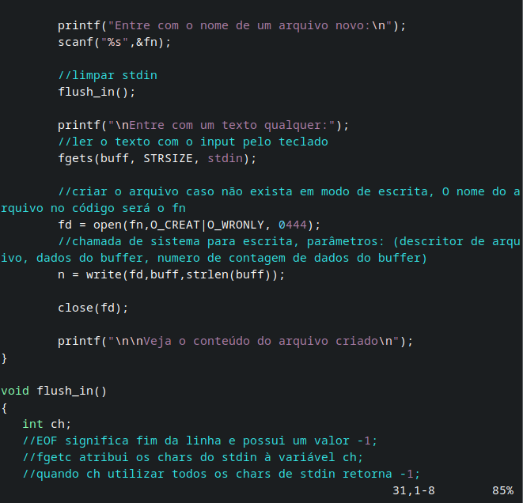
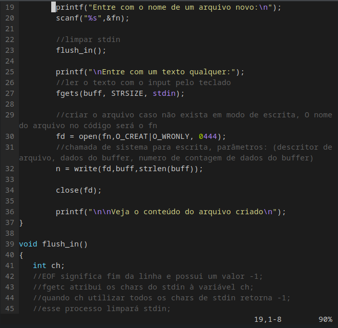
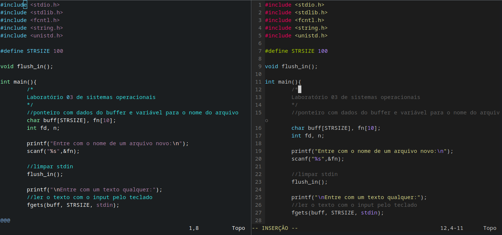

# CustomVim
a simple and quick code for styling the vim program.
----------
**the program will only be modified in the user account that is running it, to change it in the system modify the file in /etc/vim/vimrc'**

**added functions:**
- syntax highlighting
- auto indent
- mouse use
#### Before

#### After

**The previous theme can continue without assigning the monokai, just remove the line:**
> echo "colorscheme sublimemonokai" >> .vimrc

